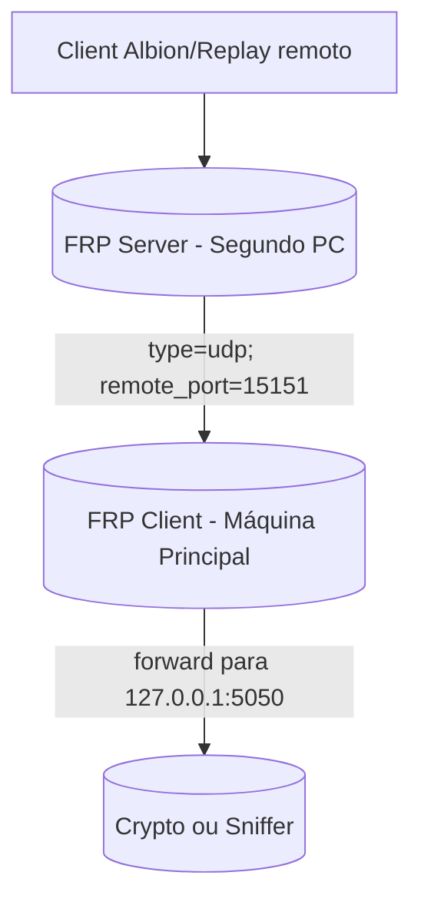

# 🚀 Albion.PortBridge - Suporte UDP com FRP

## 📋 Visão Geral

O **Albion.PortBridge** foi atualizado para suportar **tráfego UDP** através do **FRP (Fast Reverse Proxy)**, permitindo que você execute bots, replay de pacotes e sniffers do Albion Online remotamente na sua **rede local**, sem necessidade de internet pública.

## 🎯 Arquitetura



## 🚀 Início Rápido

### 1. Configuração Automática

```bash
# Execute como administrador
setup-frp.bat
```

### 2. Configuração Manual

#### No Segundo PC (Servidor Intermediário)
```bash
cd frps
install-frp.bat
run-frps.bat
```

#### Na Máquina Principal (com Crypto)
```bash
cd frpc
install-frp.bat
# Edite frpc.ini com o IP do segundo PC
run-frpc.bat
```

### 3. Teste de Conectividade

```bash
# Via Makefile
make test-udp

# Via Python
cd test && python test-udp.py

# Via PowerShell
cd test && .\test-udp.ps1
```

## 🗂️ Estrutura do Projeto

```
Albion.PortBridge/
├── frps/                          # Servidor FRP (segundo PC)
│   ├── frps.ini                  # Configuração do servidor
│   ├── run-frps.bat             # Script de execução
│   ├── install-frp.bat          # Download automático do FRP
│   └── README.md                # Documentação específica
├── frpc/                         # Cliente FRP (máquina principal)
│   ├── frpc.ini                 # Configuração do cliente
│   ├── run-frpc.bat             # Script de execução
│   ├── install-frp.bat          # Download automático do FRP
│   └── README.md                # Documentação específica
├── test/                         # Scripts de teste
│   ├── test-udp.py              # Teste Python
│   └── test-udp.ps1             # Teste PowerShell
├── setup-frp.bat                 # Configuração automática
├── firewall-rules.bat            # Regras de firewall
├── Makefile                      # Comandos atualizados
└── env.example                   # Configurações de exemplo
```

## ⚙️ Configurações

### Variáveis de Ambiente (.env)

```bash
# IP do segundo PC onde roda o servidor FRP
FRP_SERVER_IP=192.168.18.31

# Porta do servidor FRP
FRP_SERVER_PORT=6000

# Porta do túnel UDP (onde clientes se conectam)
FRP_TUNNEL_PORT=15151

# Porta local do serviço Crypto/Sniffer
FRP_LOCAL_PORT=5050

# Token de autenticação FRP
FRP_TOKEN=albion123
```

### Portas Utilizadas

| Serviço | Porta | Protocolo | Descrição |
|----------|-------|-----------|-----------|
| FRP Server | 6000 | UDP | Aceita conexões de túneis |
| FRP Dashboard | 7500 | TCP | Interface web de monitoramento |
| FRP Tunnel | 15151 | UDP | Porta pública para clientes |
| Crypto Local | 5050 | UDP | Serviço local do Albion |

## 🔧 Comandos Makefile

```bash
# Configuração FRP
make frp-setup          # Instruções de configuração
make frp-test           # Testa túnel FRP UDP

# Testes
make test-udp           # Testa conectividade UDP

# Comandos existentes
make help               # Lista todos os comandos
make start              # Inicia serviços Docker
make stop               # Para serviços Docker
```

## 🧪 Testes

### Teste Básico UDP
```bash
cd test
python test-udp.py
```

### Teste com PowerShell
```powershell
cd test
.\test-udp.ps1
```

### Teste com Netcat
```bash
echo "ping" | nc -u 192.168.18.31 15151
```

## 🚨 Troubleshooting

### Problemas Comuns

#### 1. Conexão Recusada
- ✅ Verifique se o frps está rodando no segundo PC
- ✅ Confirme o IP no frpc.ini
- ✅ Execute `firewall-rules.bat`

#### 2. Túnel Não Funciona
- ✅ Confirme que o serviço local está rodando na porta 5050
- ✅ Verifique os logs do frpc
- ✅ Teste conectividade local primeiro

#### 3. Firewall Bloqueando
- ✅ Execute `firewall-rules.bat` como administrador
- ✅ Verifique regras do Windows Defender
- ✅ Confirme portas 6000/UDP e 15151/UDP

### 🔴 **PROBLEMA CRÍTICO: Porta 5050 Ocupada**

**Sintoma:** O Albion.PortBridge não consegue iniciar na porta 5050, mostrando erro de "porta já em uso".

**Causa:** A porta 5050 está sendo ocupada por outro processo do Windows (geralmente `svchost.exe` com serviço `CDPSvc`).

**Solução Obrigatória:**

#### **Passo 1: Identificar o Processo Ocupante**
```powershell
# Verificar qual processo está usando a porta 5050
netstat -ano | findstr :5050

# Exemplo de saída:
# UDP    0.0.0.0:5050           *:*                                    10432
```

#### **Passo 2: Identificar o Serviço Específico**
```powershell
# Verificar qual serviço está rodando no PID identificado
tasklist /SVC /FI "PID eq 10432"

# Exemplo de saída:
# Nome da imagem    Identifi Serviços
# ========================= ======== ============================================
# svchost.exe          10432 CDPSvc
```

#### **Passo 3: Finalizar o Serviço Ocupante**
```powershell
# Opção 1: Parar o serviço (recomendado)
sc stop CDPSvc

# Opção 2: Desabilitar o serviço permanentemente
sc config CDPSvc start= disabled

# Opção 3: Forçar finalização do processo (último recurso)
taskkill /PID 10432 /F
```

#### **Passo 4: Verificar Liberação da Porta**
```powershell
# Confirmar que a porta foi liberada
netstat -ano | findstr :5050

# Se não retornar nada, a porta foi liberada com sucesso
```

#### **Scripts Automatizados**
Execute um dos scripts criados especificamente para este problema:

```bash
# Script Batch (execute como administrador)
stop-cdp-service.bat

# Script PowerShell (execute como administrador)
stop-cdp-service.ps1

# Script para forçar liberação da porta
force-release-port-5050.bat
```

#### **⚠️ IMPORTANTE:**
- **Execute sempre como administrador** para ter permissões suficientes
- O serviço `CDPSvc` pode reiniciar automaticamente - use `sc config CDPSvc start= disabled` para desabilitar permanentemente
- Se o problema persistir, pode ser necessário reiniciar o computador

### Logs e Debug

#### Servidor FRP
```bash
cd frps
tail -f frps.log
```

#### Cliente FRP
```bash
cd frpc
tail -f frpc.log
```

#### Dashboard Web
- Acesse: http://localhost:7500
- Usuário: `admin`
- Senha: `admin123`

## 🔒 Segurança

### Recomendações
- ✅ Use tokens fortes para autenticação
- ✅ Habilite criptografia (`use_encryption = true`)
- ✅ Habilite compressão (`use_compression = true`)
- ✅ Restrinja acesso por IP se necessário
- ✅ Monitore logs regularmente

### Configurações de Segurança
```ini
[common]
use_encryption = true
use_compression = true
token = seu_token_forte_aqui

[dashboard]
dashboard_user = usuario_seguro
dashboard_pwd = senha_forte_aqui
```

## 📚 Recursos Adicionais

### Documentação
- [FRP Official Docs](https://gofrp.io/docs/)
- [GitHub FRP](https://github.com/fatedier/frp)
- [Exemplos de Configuração](https://github.com/fatedier/frp/tree/master/examples)

### Ferramentas Relacionadas
- **Wireshark**: Análise de pacotes UDP
- **Netcat**: Testes de conectividade
- **Python Socket**: Desenvolvimento de clientes UDP

## 🤝 Contribuição

Para contribuir com o projeto:

1. Fork o repositório
2. Crie uma branch para sua feature
3. Commit suas mudanças
4. Push para a branch
5. Abra um Pull Request

## 📄 Licença

Este projeto está licenciado sob a [MIT License](LICENSE).

## 🆘 Suporte

Se encontrar problemas:

1. Verifique a seção de troubleshooting
2. **Para porta 5050 ocupada, use a solução obrigatória acima**
3. Consulte os logs do FRP
4. Abra uma issue no GitHub
5. Inclua logs e configurações relevantes

---

**🎮 Agora você pode executar bots e replay de pacotes do Albion Online remotamente na sua rede local!**
